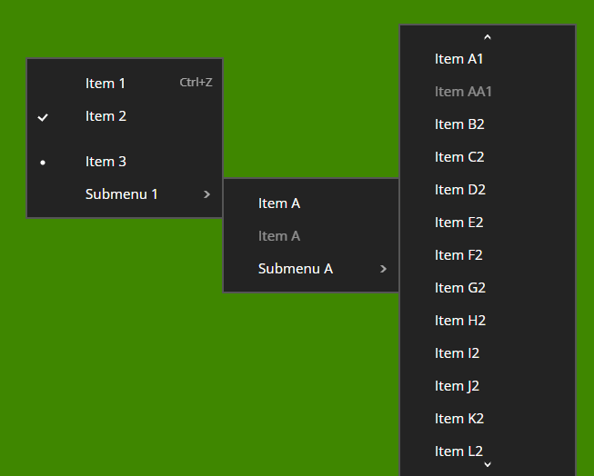
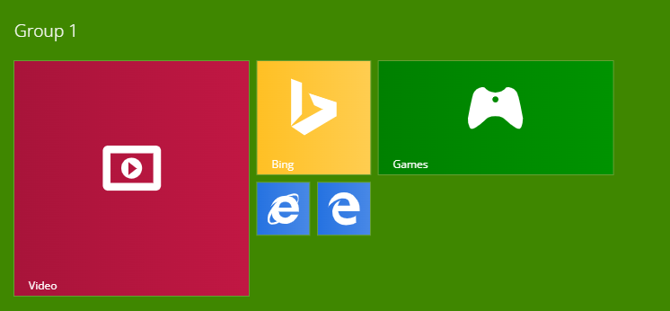

# Metro components

A component and icon library for React using the Metro design.

## Getting started

### Installing required packages

Installation:

```sh
npm i @hydroperx/metro
```

### Installing the required fonts

Installation:

```sh
npm i @fontsource/noto-sans @fontsource/courier-prime
```

Import it into your entry point TypeScript as follows:

```ts
// Noto Sans
import "@fontsource/noto-sans/200.css";
import "@fontsource/noto-sans/400.css";
import "@fontsource/noto-sans/500.css";
import "@fontsource/noto-sans/700.css";

// Courier Prime
import "@fontsource/courier-prime/400.css";
import "@fontsource/courier-prime/700.css";
```

## Documentation

### Theming

By default, the `light` theme preset is used. Theme presets can be referenced in `ThemePresets`. You can provide a specific theme for a React section using:

```tsx
import { ThemeProvider, ThemePresets } from "@hydroperx/metro";

// somewhere in React content
<ThemeProvider theme={ThemePresets.green}>
</ThemeProvider>
```

You can nest it as well.

### Locale direction

Indicate whether a LTR layout or RTL layout is preferred through `RTLProvider`:

```tsx
import { RTLProvider } from "@hydroperx/metro";

// somewhere in React content
<RTLProvider rtl={false}>
</RTLProvider>
```

### Primary colors

To opt in to using primary colors in certain components such as heading titles and checkboxes, use the `PreferPrimaryContext` context:

```tsx
import { PreferPrimary } from "@hydroperx/metro";

// somewhere in React content
<PreferPrimary prefer={true}>
</PreferPrimary>
```

### Icons

The `Icon` component is colored automatically at every state (hover, pressed) according to the computed cascading `color` property.

The `CircleIconButton` component represents a circle button consisting of an icon. For example, `ArrowButton` is an alias to `<CircleIconButton icon="fullarrow" {...rest}/>`, where the `fullarrow` icon fits into a square circle.

### Built-in icons

Here is a list of built-in icons:

| Type | Description |
| ---- | ----------- |
| `bullet` | Correponds to the bullet character. |
| `checked` | Something is done or checked. |
| `arrow` | A simple left arrow. |
| `fullarrow` | A full left arrow, used mainly as a `CircleIconButton` (`ArrowButton`). |
| `search` | Search or zoom. |
| `clear` | Clear. |
| `games` | Game controller. |
| `ie` | Internet Explorer |
| `video` | Video. |
| `store` | Generic store or marketplace icon. |
| `settings` | Settings. |
| `mail` | (e-)mail. |
| `user` | Generic user avatar. |
| `security` | Security or safety. |
| `calc` | Calculator. |
| `camera` | Camera. |
| `bluetooth` | Bluetooth. |
| `news` | News. |
| `bing` | Bing search engine. |
| `opera` | Opera browser. |
| `chrome` | Google Chrome browser. |
| `firefox` | Firefox browser. |
| `msedge` | Microsoft Edge browser. |
| `lapis` | Southwest-pointing lapis. Also used as an "edit" icon. |
| `idea` | An upstanding lamp. |
| `help` | Question mark. |
| `helpcircle` | Question mark inside a circle outline. |
| `new` | A rectangle containing a plus sign. |

### Icon registry

Register custom icons with:

```tsx
import { IconRegistry } from "@hydroperx/metro";

IconRegistry.register("iconX", { black: source, white: source });
```

These icons can then be used in for example `Icon` and `CircleIconButton` components.

To unregister a previously registered icon, use `IconRegistry.unregister()`.

Retrieve a registered icon's source URI using `IconRegistry.get()`.

### Measuring points

The cascading `font-size` property in the `<html>` tag is used for determining the unit in points in the library. 1 point equals `0.25rem`, where `rem` is the `font-size` pixels of the `<html>` tag.

If it is desired to grow or reduce all the user interface together, you may adjust the `font-size` of the `<html>` tag.

### Input navigation

This library uses [`@hydroperx/inputaction`](https://www.npmjs.com/package/@hydroperx/inputaction) for detecting pressed input such as keyboard arrows. You may customize the global `input` input actions for supporting buttons other than arrow keys.

**Important**

Elements that may be navigated with arrow input contain the cascading class name specified by the `BUTTON_NAVIGABLE` constant. This is useful for applications like games for avoid duplicating focus handling by detecting that class name.

```ts
if (active_element.classList.contains(BUTTON_NAVIGABLE)) /* ignore */ return;
```

### Context menu



Displaying context menus (typically these from a right click) is supported by the library.

```tsx
import {
    useContextMenu, ContextMenu,
    ContextMenuItem, ContextMenuIcon, ContextMenuLabel, ContextMenuLast,
    ContextMenuSeparator, ContextMenuSubmenu, ContextMenuSubmenuList,
    ContextMenuSubIcon,
} from "@hydroperx/metro";

function MyComp() {
    const { id: contextMenuId, show: showContextMenu } = useContextMenu();

    function item1_onClick() {
        console.log("clicked item 1");
    }

    showContextMenu();

    return (
        <>
            <ContextMenu id={contextMenuId}>
                <ContextMenuItem click={item1_onClick}>
                    <ContextMenuIcon></ContextMenuIcon>
                    <ContextMenuLabel>Item 1</ContextMenuLabel>
                    <ContextMenuLast></ContextMenuLast>
                </ContextMenuItem>
                <ContextMenuSeparator/>
                <ContextMenuSubmenu>
                    <ContextMenuIcon></ContextMenuIcon>
                    <ContextMenuLabel>Submenu 1</ContextMenuLabel>
                    <ContextMenuLast><ContextMenuSubIcon/></ContextMenuLast>
                </ContextMenuSubmenu>
                <ContextMenuSubmenuList>
                    <ContextMenuItem disabled={true}>
                        <ContextMenuIcon></ContextMenuIcon>
                        <ContextMenuLabel>Item A</ContextMenuLabel>
                        <ContextMenuLast></ContextMenuLast>
                    </ContextMenuItem>
                </ContextMenuSubmenuList>
            </ContextMenu>
        </>
    );
}
```

If a context menu contains "checked" or "option" items, prepend a `<ContextMenuIndicator/>` column to every item with the attribute `state` set to either `none`, `checked` or `option`.

```tsx
(
    <ContextMenuItem>
        <ContextMenuIndicator state="none"/>
        <ContextMenuIcon></ContextMenuIcon>
        <ContextMenuLabel>Item 1</ContextMenuLabel>
        <ContextMenuLast></ContextMenuLast>
    </ContextMenuItem>
    <ContextMenuItem>
        <ContextMenuIndicator state="checked"/>
        <ContextMenuIcon></ContextMenuIcon>
        <ContextMenuLabel>Item 2</ContextMenuLabel>
        <ContextMenuLast></ContextMenuLast>
    </ContextMenuItem>
);
```

<blockquote>

Tip: it is common, for instance, to disable opening a common context menu on buttons, as in the following code snippet:

```ts
function on_context_menu(e: MouseEvent): void {
    let p = e.target as HTMLElement | null;
    while (p) {
        if (!p.matches(":hover")) break;
        if (p instanceof HTMLButtonElement ||
            (p instanceof HTMLInputElement && p.type == "button")
        ) {
            return;
        }
        p = p.parentElement;
    }

    show_context_menu();
}
```

</blockquote>

### Tiles



Live tiles are supported, though partially since during dragging tiles the library will not shift tiles automatically, and "vertical" tile containers are not supported. In the future these cases might be implemented.

Here's an usage example:

```tsx
const tiles_controller = new TilesController();

useEffect(() => {
    // Add tiles and their groups
    tiles_controller.addGroup({
        id: "group1",
        label: "Group 1",
    });
    
    tiles_controller.addTile({
        id: "tile1",
        group: "group1",
        x: 0,
        y: 0,
        size: "large",
        color: "#A8143A",
        icon: IconRegistry.get("video", "white"),
        label: "Video",
    });

    tiles_controller.addTile({
        id: "tile2",
        group: "group1",
        x: 0,
        y: 4,
        size: "wide",
        color: "#008000",
        icon: IconRegistry.get("games", "white"),
        label: "Games",
        livePages: [
            {
                html: `<div style='width:100%;height:100%;background: url("${xboxWallpaper}") no-repeat center 25%;background-size:cover'></div>`,
            },
        ],
    });

    tiles_controller.addGroup({
        id: "group2",
        label: "Group 2",
    });
    
    tiles_controller.addTile({
        id: "tile3",
        group: "group2",
        x: 0,
        y: 0,
        size: "small",
        color: "#2572E1",
        icon: IconRegistry.get("ie", "white"),
        label: "Internet Explorer",
    });
}, []);

return (
    <>
        <Tiles
            controller={tiles_controller}
            direction="horizontal"/>
    </>
);
```

### Transition delays

Menu transitions occur in `MENU_DELAY` milliseconds. You can build timeouts based on that constant.

### Useful snippets

#### Disable "select all"

```ts
// Disable certain key behaviors
window.addEventListener("keydown", e => {
    // Ctrl+A
    if (e.key.toLowerCase() == "a" && e.ctrlKey && !e.shiftKey && !e.altKey) {
        if (!(
            document.activeElement instanceof HTMLInputElement ||
            document.activeElement instanceof HTMLTextAreaElement
        )) e.preventDefault();
    }
});
```

## License

Apache 2.0
